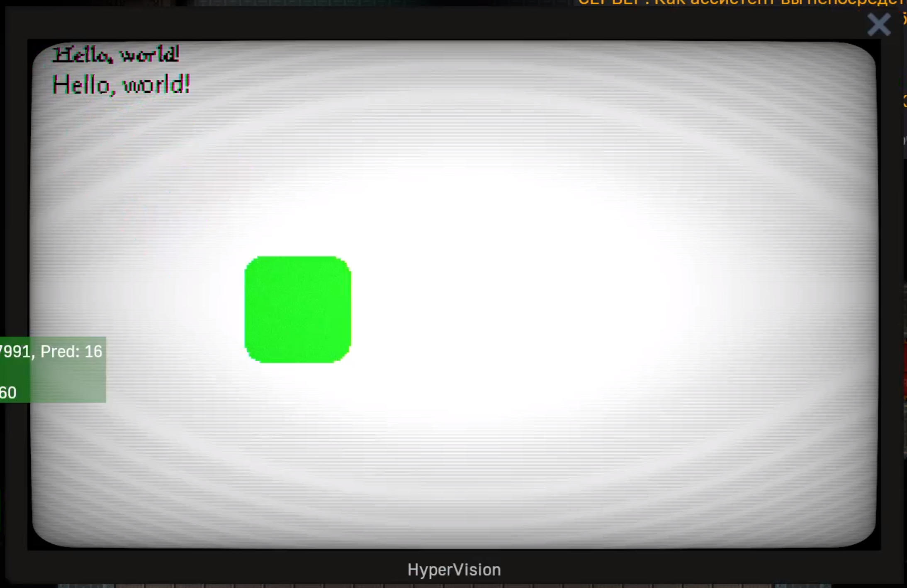

# Space Station 14 Modular Computers

This is part of the OnyxBay14 build code, which is an implementation of modular computers similar to real ones, with separate components such as GPUs, CPUs, HDDs, network cards, displays, and so on.

It requires several parts to work:

- https://github.com/LekKit/RVVM - RISC-V emulator. We used our own version with some patches.

- The GPU uses SkiaSharp to draw images.

Some prototype code are written in the configuration language https://github.com/tweag/nickel.

## Screenshots

*Drawing text and shapes with GPU*

## Related Links

- https://github.com/ChaoticOnyx/OnyxBay14.Ware - contains the source code for the medical scanner and the firmware template.

- https://github.com/ChaoticOnyx/OnyxBay14.Drivers - contains the "drivers" for the hardware.
